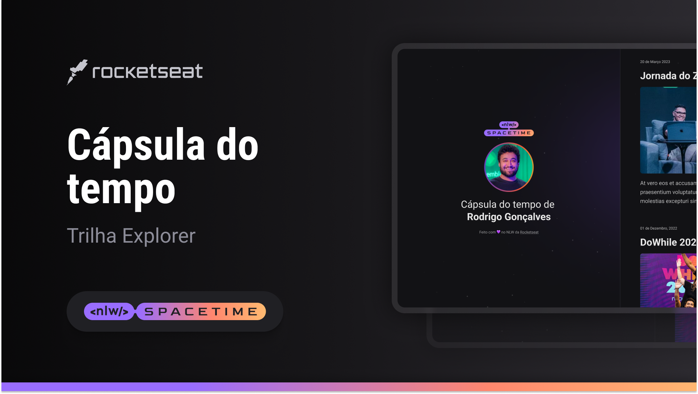

# 👨‍🚀 SPACETIME

## 🖥️ Projeto
Esse é um projeto web de cápsula do tempo que exibe memórias em uma linha do tempo.

## 🚀 tecnologias
Esse projeto foi desenvolvido no NWL da Rocketseat com as seguintes tecnologias:

- HTML
- CSS
- Git e Github

## 🏷️ Layout
você pode visualizar o layout do projeto através [desse link](https://www.figma.com/file/LPHzsko3GITLOLqzo6GXsg/C%C3%A1psula-do-tempo-%E2%80%A2-Trilha-Explorer-(Community)?type=design&node-id=306-84&t=Bj7URpZxHkEketFm-0)
É necessário ter uma conta no [Figma](https://www.figma.com)